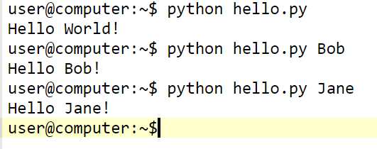

# Assignment: Hello World

## Description

Create a script file that welcomes the user given to it. If no name was given, then it welcomes the whole world.

Submit your Python script file.

## Expectations

  * The name is provided as the command line argument of the script.
  * Structure your code: Separate some logic into functions.

## How to use the command line arguments

By importing the sys module, you can access all the given arguments as a list. Read about how to do it in this article: <https://linux.die.net/diveintopython/html/scripts_and_streams/command_line_arguments.html>

## Expected Console Output

